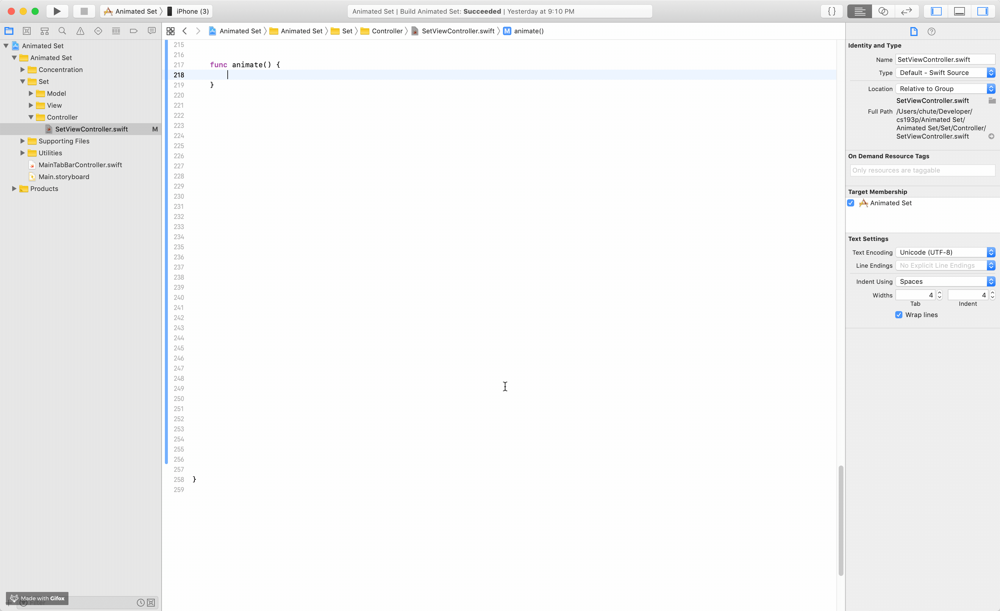

## Overview

This is a simple XCode extension to convert a one-line function call (or declaration) into a multi-line one. Useful for functions with many parameters.

## Installation

- Download latest *Convert to Multi-Line Function* package from the [Releases](https://github.com/chrischute/xcode-multi-line-func/releases).
- Copy *Convert to Multi-Line Function* to your *Applications* folder.
- Launch *Convert to Multi-Line Function* once. You can close it immediately afterwards.
- Go to <kbd>System Preferences</kbd> > <kbd>Extensions</kbd> > <kbd>Xcode Source Editor</kbd> > select <kbd>Convert to Multi-Line Function</kbd>

## Setting Hotkey in Xcode

- Open Xcode
- Go to Xcode > Preferences > Key Bindings
- Type *'convert to multi-line function'* in search field
- Assign <kbd>⌃</kbd> + <kbd>⌘</kbd> + <kbd>N</kbd> to *Convert to Multi-Line Function* command
